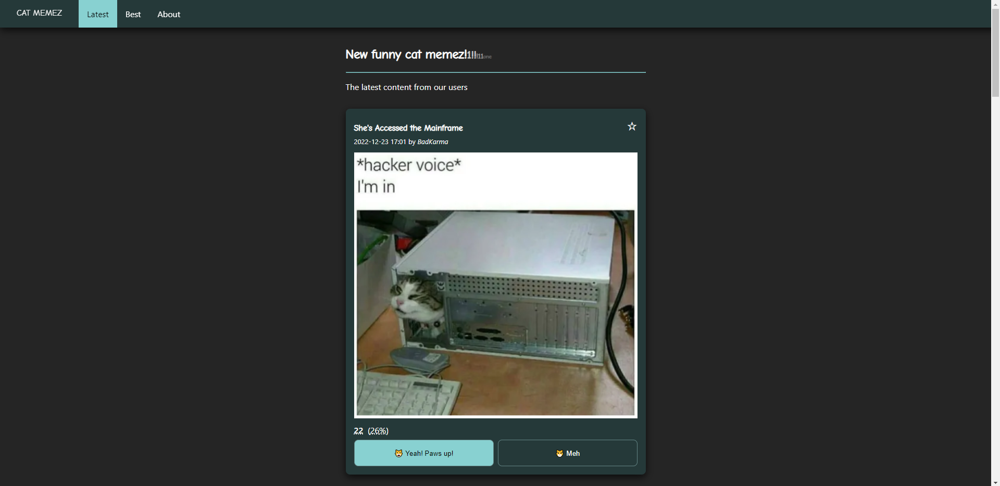
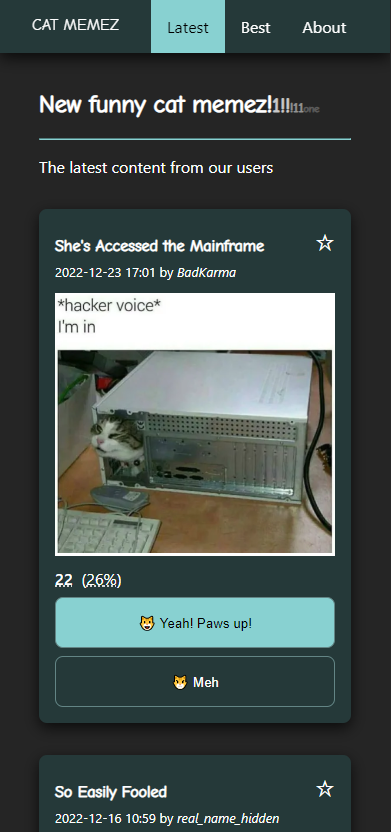

# Cat Memez

## Purpose

Post-graduate studies final project.

## About

The application displays a list of images (memes) and allows user to either upvote or downvote individual memes.

## Features

* Display a static list of memes divided into two sets: all memes and best memes
* Vote for a meme
* Add meme to favorites by clicking a star icon

### Note

The meme with id = 10 (_The Answer to the Riddle_) has votes count predfined in such a way that upvote will move it to the best memes.

## Running the Application

Navigate to the project directory in your command line application and use command:

`npm start`

It will Run the application in the development mode.\
Open [http://localhost:3000](http://localhost:3000) to view it in your browser.

## About the Memes

The memes and their title in this app has been taken from [https://bestlifeonline.com/funniest-cat-memes-ever/](https://bestlifeonline.com/funniest-cat-memes-ever/)

## Other

This project was bootstrapped with [Create React App](https://github.com/facebook/create-react-app).
